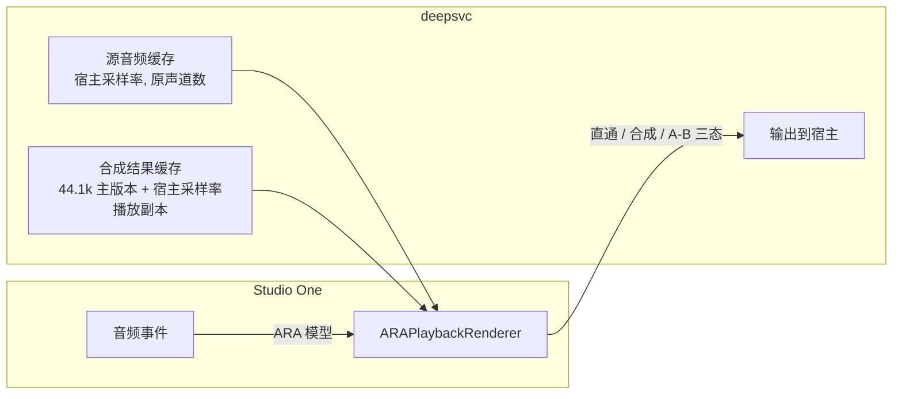
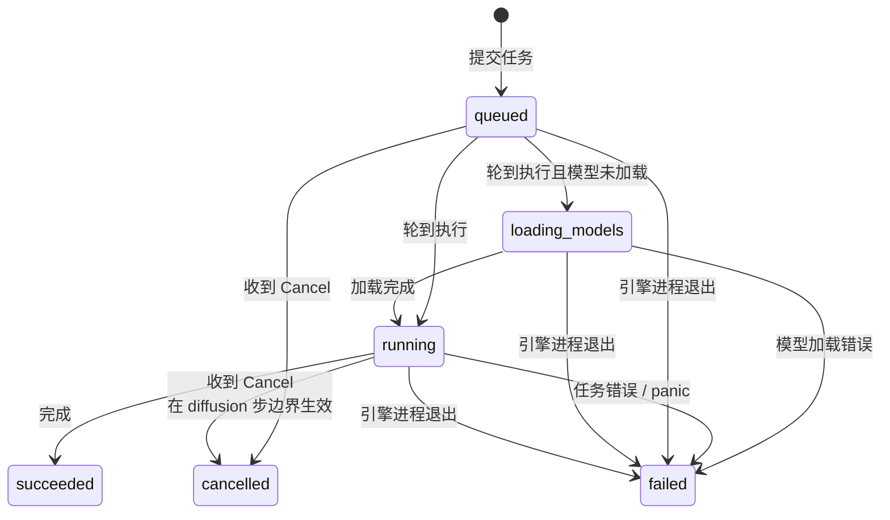

# deepsvc ARA 插件设计

## 1. 目标与总体形态

- 插件名称 **deepsvc**，形态为 ARA 2 Event FX，目标宿主为 macOS 上的 Studio One。Studio One 的 ARA 功能只认 VST3，因此 VST3 是必需格式；AU 顺带构建，供其他支持 ARA 的宿主使用。
- 使用方式：在 Studio One 中右键音频事件 → Event FX → deepsvc（6.2 及以上版本可直接把插件拖拽到事件上）。每个事件对应一个实例，双击事件打开编辑器。
- 添加实例后不触发任何计算：不启动引擎、不做音高检测、不做合成。此时事件播放原声直通（ARA 宿主会把事件音频路由给插件渲染）。
- 音高检测与合成各由一个按钮触发；合成任务内部自动包含音高检测阶段。参数可以反复调整并重新合成，新结果替换旧结果参与播放。
- 音高检测结果显示在钢琴卷上。
- 推理在独立的引擎进程 `deepsvc-engine` 中执行：模型权重全机只有一份，所有插件实例（包括多个宿主进程）共享；引擎具备任务级错误隔离与进程级故障恢复能力，用户可以在界面上手动杀死或重启引擎（见 5.3 节）。
- 功能集合与 audiokit 的 YingMusic-svc 模块（不含视频部分）相同。
- 插件本体使用 JUCE 8（C++，负责 ARA、界面、宿主交互、回放），推理由 Rust 引擎进程执行（直接使用 `yingmusic` crate），两者经 Unix domain socket 通信。

## 2. 仓库布局与依赖

`svc-ara` 根目录即 deepsvc 仓库（`git init` 初始化），已有的 `yingmusic-svc-mlx` 克隆就地注册为 submodule。

```
svc-ara/
├── AGENTS.md
├── build.py                    # 一键构建并安装（见第 7 节）
├── CMakeLists.txt              # 顶层构建
├── docs/ara.md                 # 本文件
├── modules/
│   ├── JUCE/                   # submodule: github.com/juce-framework/JUCE（8.x，固定 commit）
│   ├── ARA_SDK/                # submodule: github.com/Celemony/ARA_SDK
│   └── msgpack-cxx/            # submodule: github.com/msgpack/msgpack-c（C++ 侧 MessagePack，header-only）
├── yingmusic-svc-mlx/          # submodule（已存在；nested submodules: mlx-vocoders、rmvpe-mlx、fcpe-mlx）
├── native/                     # deepsvc-engine：Rust 二进制 crate（引擎进程）
│   ├── Cargo.toml              # [[bin]]，path 依赖 ../yingmusic-svc-mlx；serde + rmp-serde
│   └── src/...
└── plugin/                     # JUCE ARA 插件本体
    ├── CMakeLists.txt
    └── Source/...
```

以上依赖全部以 submodule 形式固定 commit。`build/` 目录加入 `.gitignore`。

备注：ARA SDK 对个人与内部使用无限制；若未来商业分发，需要与 Celemony 签订 ARA 许可协议。

## 3. yingmusic-svc-mlx 的 API 扩展

兼容性要求：该 crate 同时被 audiokit 等应用使用，已有公开 API（`YingMusicSvc::new`、`YingMusicSvc::infer`、`InferParams`、`InferResult`、`Progress`、`F0Estimator`、`YingMusicSvcPaths`）的签名与行为必须保持不变，插件所需能力以新增函数、新增类型、提升可见性的方式加入：

1. **音高检测公开入口**：`f0.rs` 的 `F0Estimators` 提升为 `pub`，并新增 `pub fn estimate_f0(&mut self, estimator: F0Estimator, audio_16k: &[f32]) -> Result<Vec<f32>>`，返回 100 fps 的 F0 序列（Hz，0 表示清音；FCPE 分支在内部把 `Array` 转为 `Vec<f32>`）。引擎进程执行检测任务时只需加载 RMVPE/FCPE 两个小模型，无需加载合成所需的其余模型。
2. **内存形态的合成接口**：`core.rs` 新增
  ```rust
   pub fn infer_samples<F: FnMut(Progress) -> bool>(
       &mut self,
       source_44k: &[f32],
       reference_44k: &[f32],
       params: &InferParams,
       progress: Option<&mut F>,
   ) -> Result<InferSamplesResult>;
  ```
  - `InferSamplesResult { audio: Vec<f32>, first_vocoder: Option<Vec<f32>>, f0: Vec<f32> }` 为新增类型并在 `lib.rs` 导出；其中 `f0` 是本次合成实际使用的源音频检测结果（未施加 `pitch_shift`，100 fps），调用方用它刷新钢琴卷，保证钢琴卷与合成所依据的曲线一致；
  - 进度回调返回 `false` 表示请求取消，在 diffusion 每步与 chunk 边界检查并中止；
  - 原 `infer` 保持原签名与原行为。
3. **重采样与增益函数提升可见性**：`io.rs` 的 `resample_mono`、增益处理等提升为 `pub`，供引擎进程把任意采样率输入转换到 16k/44.1k。
4. `lib.rs` 追加导出 `InferSamplesResult` 与 `F0Estimators`。

视频相关能力（`collect_video_mel`、`MelVideo`）插件不使用，调用时固定传 `false`。

## 4. deepsvc-engine 与 IPC 协议

### 4.1 进程与通信

- 引擎为 Rust 二进制 `deepsvc-engine`，打包进插件 bundle 的 `Contents/Resources/deepsvc-engine`（VST3 与 AU 各持有一份），随包体一起安装；运行时由插件从自身 bundle 内启动。
- 通信通道：Unix domain socket，地址 `~/Library/Application Support/deepsvc/run/engine.sock`，同目录下放 `engine.lock`（文件锁，保证单例）。
- 帧格式：4 字节小端长度 + MessagePack 正文，Rust 侧使用 `rmp-serde`，C++ 侧使用 `msgpack-cxx`。单帧上限 512 MB，超限立即断开连接并报告错误。
- 音频载荷走 MessagePack 的 bin 类型：源音频来自 ARA（磁盘上没有对应文件），必须经 IPC 传输（5 分钟 44.1k 单声道 f32 约 53 MB，本机 socket 传输耗时可以忽略）；参考音色传文件路径（音色库在磁盘上，引擎直接读取）。

### 4.2 消息集

客户端（插件）→ 引擎：


| 消息             | 载荷                                                                             |
| -------------- | ------------------------------------------------------------------------------ |
| `Hello`        | `protocol_version`                                                             |
| `SubmitDetect` | `job_id`, `pcm`(bin), `sample_rate`, `estimator`                               |
| `SubmitSynth`  | `job_id`, `src_pcm`(bin), `src_sample_rate`, `reference_path`, `params`（6 个参数） |
| `Cancel`       | `job_id`                                                                       |
| `Shutdown`     | —                                                                              |


引擎 → 客户端：


| 消息             | 载荷                                                                |
| -------------- | ----------------------------------------------------------------- |
| `HelloAck`     | `protocol_version`, `engine_version`, `pid`                       |
| `JobState`     | `job_id`, `state`, `queue_position`, `stage`, `fraction`, `error` |
| `DetectResult` | `job_id`, `f0`(bin)                                               |
| `SynthResult`  | `job_id`, `audio`(bin), `first_vocoder`(bin, 可选), `f0`(bin)       |


`JobState` 在任务每次状态变化时发送；`running` 状态下进度事件引擎侧节流至 50 ms 一次。队列变化向所有已连接客户端广播，各实例界面都能显示排队位置。

## 5. 插件架构

### 5.1 类结构

```
plugin/Source/
├── PluginProcessor.{h,cpp}           # AudioProcessor + AudioProcessorARAExtension，APVTS 持有 6 个参数
├── DeepSvcDocumentController.{h,cpp} # ARADocumentControllerSpecialisation：归档读写、内容变更通知
├── DeepSvcPlaybackRenderer.{h,cpp}   # ARAPlaybackRenderer：实时回放（直通 / 合成结果 / A-B 对比）
├── EngineClient.{h,cpp}              # Unix socket + MessagePack 协议客户端（每实例一条连接）
├── EngineSupervisor.{h,cpp}          # 引擎进程的启动、探测、杀死、重启（进程级单例）
├── JobManager.{h,cpp}                # 任务提交、状态流转、进度与结果分发到界面
├── RenderCache.{h,cpp}               # 合成结果的内存持有与磁盘持久化，原子交接给音频线程
├── TimbreLibrary.{h,cpp}             # 全局音色库（导入/删除/重命名/选择）
├── model/
│   ├── PitchData.{h,cpp}             # F0 帧序列
│   └── DocumentState.{h,cpp}         # 每实例持久化状态
└── ui/
    ├── DeepSvcLookAndFeel.{h,cpp}    # 设计令牌与组件样式（LookAndFeel_V4 子类）
    ├── DeepSvcEditor.{h,cpp}         # ARAEditorView：整体布局
    ├── PianoRollComponent.{h,cpp}    # 钢琴卷
    ├── TimbrePanel / ParameterPanel / StatusBar
```

CMake 侧：先 `juce_set_ara_sdk_path(modules/ARA_SDK)`，再 `juce_add_plugin(deepsvc FORMATS VST3 AU IS_ARA_EFFECT TRUE ARA_DOCUMENT_ARCHIVE_ID "com.deepsvc.archive" ...)`，并实现全局 `createARAFactory()`。插件为纯 C++ 目标，`msgpack-cxx` 以 interface target 引入头文件。

### 5.2 音频通路




- ARA 把事件音频路由给插件的 `ARAPlaybackRenderer::processBlock` 实时渲染，共三态：
  - **直通**（尚未合成）：输出源音频缓存；
  - **合成**：按 playback region 的样本偏移读取合成结果缓存；
  - **A-B 对比**：界面开关在两者间切换，便于调参后对比。
- 源音频在 ARA 内容就绪或变更后，经 `ARAAudioSourceReader` 在非实时线程一次性读入内存并重采样到宿主采样率；`processBlock` 只做无锁读取。这份源音频缓存同时作为提交任务时的 PCM 来源。合成结果经 `std::atomic<std::shared_ptr<const Buffer>>` 交换交接，音频线程无锁。
- 引擎固定工作在 44.1k：输入在引擎侧重采样；输出保留 44.1k 主版本，`prepareToPlay` 时重采样出宿主采样率播放副本（宿主改变采样率时重建副本）。
- 时长：管线输出与输入等长（分块交叉淡入拼接保持时长），渲染器按 region 偏移取值、越界补零；实施阶段用测试验证这一性质。
- 声道：源音频缩混成单声道进引擎（与 audiokit 一致），合成结果在 region 各声道同相输出；直通保持原声道数。
- 时间伸缩：`ARA_TRANSFORMATION_FLAGS` 声明 `kARAPlaybackTransformationNoChanges`，宿主对事件做拉伸时由 Studio One 自己的算法处理插件输出。

### 5.3 引擎进程：生命周期、任务队列与错误恢复

#### 生命周期

- **启动**：实例提交任务时若连接 socket 失败，由 `EngineSupervisor` 从自身 bundle 的 `Contents/Resources/deepsvc-engine` 启动引擎进程（经 `juce::File::getSpecialLocation::currentExecutableFile` 定位 bundle），并等待 socket 就绪（超时 10 秒则报错）。引擎启动时绑定 socket 并对 `engine.lock` 加文件锁，已有引擎在运行则新进程直接退出，保证全机单例。
- **握手**：连接后交换 `Hello`/`HelloAck`，校验协议版本并记录引擎 pid；协议版本不一致时界面提示重新运行 `build.py`。
- **模型懒加载**：引擎进程启动后不加载任何模型；首个检测任务触发加载 RMVPE/FCPE，首个合成任务触发加载合成所需的全部模型（任务进入 `loading_models` 状态）。加载完成后权重常驻内存，释放内存的手段是重启引擎。
- **停止**：界面提供两个操作——
  - **重启引擎**：发送 `Shutdown`（引擎取消当前任务、拒绝新任务后退出），由 supervisor 重新启动；
  - **强制杀死引擎**：按 pid 发送 `SIGKILL`，用于 GPU 调用卡死等无响应场景。

#### 任务队列与状态流转




- 引擎内为全局 FIFO 串行队列：单块 GPU 上并跑多份 diffusion 没有收益，`YingMusicSvc` 的推理入口也都是 `&mut self`。
- 任务属主为提交它的那条客户端连接；客户端断开时，其排队任务丢弃，运行中任务在下一个检查点取消（宿主关闭工程时的自然行为）。

#### 错误恢复

- **任务级隔离**：引擎在任务边界使用 `catch_unwind`，单个任务的 panic 或错误使该任务进入 `failed`（携带错误信息），引擎进程继续服务后续任务。
- **进程级故障**：引擎崩溃或被杀死时 socket 断开，内核保证所有客户端立即感知；进行中与排队中的任务标记 `failed`（原因：引擎进程退出）；已完成的合成结果不受影响（`RenderCache` 在插件侧持有）。
- **无响应检测**：任务运行期间引擎以 50 ms 节流上报进度；超过 60 秒没有任何进度事件时，界面提示「引擎可能无响应」，由用户决定重启或强制杀死。
- **恢复动作**：失败任务在界面上可一键重新提交；引擎处于停止状态时，下一次任务提交会自动启动引擎。

### 5.4 状态与失效标记

每实例维护：源音频指纹、`PitchData`（F0 帧序列）、合成结果缓存键，以及各自的失效标记。

- 宿主修改事件内容（ARA `didUpdateAudioSourceContent` 等回调）→ 重新读入源音频 → F0 显示与合成结果同时标记失效。
- 修改 `f0Estimator` → F0 显示失效（连带合成结果失效）；修改其余 5 个参数或切换音色 → 仅合成结果失效。
- 失效的合成结果继续参与播放，界面显示「参数已修改，需重新合成」徽标；失效的 F0 曲线在钢琴卷上置灰显示。
- 合成任务完成时，用结果携带的 F0 刷新钢琴卷并清除失效标记。

### 5.5 持久化


| 数据                    | 位置                                                                                                                                                                         |
| --------------------- | -------------------------------------------------------------------------------------------------------------------------------------------------------------------------- |
| 6 个参数                 | APVTS → 宿主工程状态（顺带获得宿主撤销/重做）                                                                                                                                                |
| 选中音色、F0 数据、失效标记、钢琴卷视口 | ARA 文档归档（`doStore/RestoreDocumentToArchive`；F0 为 100 fps 浮点序列，5 分钟约 120 KB，直接嵌入归档）                                                                                         |
| 合成音频                  | `~/Library/Application Support/deepsvc/renders/<内容指纹>.wav`（44.1k 主版本 + 可选 first-vocoder），归档存指纹；文件缺失则恢复为失效状态                                                                |
| 音色库                   | `~/Library/Application Support/deepsvc/timbres/`（导入时拷贝音频 + `library.json` 元数据），全局跨工程共享，与 audiokit 音色库语义一致                                                                  |
| 模型目录设置                | 用户级配置文件；默认 `~/Library/Application Support/deepsvc/Models/yingmusic/`，界面提供文件夹选择与模型加载状态指示；开发期指向 `/Users/daisy/develop/audiokit/app/Models/yingmusic/`（7 个 safetensors 已确认齐全） |
| 引擎二进制                 | 插件 bundle 内 `Contents/Resources/deepsvc-engine`，随包体一起由 `build.py` 安装                                                                                                       |


## 6. 编辑器界面与钢琴卷

布局：左栏音色库，中部钢琴卷，右侧参数面板，底部操作与状态栏。中文文案与 audiokit 相同。

### 6.1 设计语言

主题色为梅粉色到浅粉色的单色阶，浅色界面。全部颜色、字号、间距、圆角定义为设计令牌，集中在 `ui/DeepSvcLookAndFeel.{h,cpp}`（继承 `LookAndFeel_V4`），所有组件只引用令牌。

颜色令牌：

| 令牌 | 取值 | 用途 |
|---|---|---|
| pink-050 | #FDF6F8 | 窗口背景、下拉面板底色 |
| pink-100 | #FBEAF0 | 面板背景、列表行悬停 |
| pink-200 | #F3D3DF | 边框、分隔线、滑杆轨道、进度条轨道 |
| pink-300 | #E9B7C9 | 钢琴卷小节线、波形包络 |
| pink-500 | #C96382 | 主色悬停 |
| pink-600 | #B5446E | 主色（梅粉）：主按钮、选中态、滑杆填充、F0 曲线 |
| pink-700 | #96365A | 主色按下 |
| pink-900 | #5C2438 | 播放头、强调元素 |
| ink-900 | #3A2931 | 主要文字 |
| ink-600 | #7A5C68 | 次要文字 |
| ink-300 | #B99AA6 | 禁用文字、失效状态的 F0 曲线 |

功能色只出现在状态栏与徽标：成功 #3E9B6D，警告/失效 #C98A2D（底色 #F9EEDD），失败 #D0454C（底色 #FBE7E8）。

字体与排版：使用系统字体（中文 PingFang SC，英文与数字 SF Pro）；正文 13px，辅助说明 12px，面板标题 14px 半粗；所有数值使用等宽数字。

间距与形状：4px 基准网格，常用间距 4/8/12/16/24；面板内边距 12px，面板间距 8px；圆角：面板与大按钮 8px，小控件 6px；边框统一 1px pink-200；不使用投影。

组件样式：

- 主按钮（开始合成、音高检测）：pink-600 填充 + 白色文字；悬停 pink-500；按下 pink-700；禁用 pink-200 底 + ink-300 字。
- 次按钮（取消、对比原声、导出 WAV）：1px pink-200 描边 + ink-900 字；悬停底色 pink-100；按下 pink-200。
- 危险操作（强制杀死引擎）：ink-600 描边按钮，点击后进入 3 秒确认态（变为失败色填充），确认后才执行。
- 滑杆：轨道 pink-200，已填充段 pink-600，滑块白色带 pink-600 描边；双击数值进入键入。
- 开关：开启 pink-600，关闭 pink-200。
- 下拉：pink-050 底，选中行 pink-100。
- 音色库列表：行悬停 pink-100；选中行 pink-200 底 + 左侧 3px pink-600 指示条。
- 进度条：轨道 pink-200，填充 pink-600。
- 徽标：失效 = 警告色文字 + 警告底色；失败 = 失败色文字 + 失败底色。

钢琴卷用色：背景 pink-050；半音线 pink-100，节拍线 pink-200，小节线 pink-300；白键 #FFFFFF，黑键 #4A3540；波形包络 pink-300；F0 曲线 pink-600、2px，失效时 ink-300；播放头 pink-900、1.5px；悬停提示为 pink-100 底 + ink-900 字 + 1px pink-200 边框。

### 6.2 音色库与参数

- **音色库面板**：列表 + 导入（文件选择器或拖入）+ 删除 + 重命名；当前选中项高亮，选择随文档持久化。
- **参数面板**：全部绑定 APVTS，双击数值可直接键入并吸附步进（与 audiokit 相同）。


| 参数                        | 类型    | 范围                      | 默认值   |
| ------------------------- | ----- | ----------------------- | ----- |
| F0 estimator              | 下拉    | RMVPE / FCPE            | RMVPE |
| 扩散步数                      | 整数    | 1–64                    | 16    |
| 音高偏移                      | 整数半音  | -24–+24（附 -12/+12 快捷按钮） | 12    |
| CFG 强度                    | 浮点    | 0–2，步进 0.05             | 0.9   |
| Input gain                | 浮点 dB | -12–+3，步进 0.5           | -2    |
| keep first vocoder output | 开关    | —                       | 关     |


- **操作栏**：`音高检测`、`开始合成`、`取消`（任务进行中可用）、`对比原声`、`导出 WAV`（把当前合成主版本写到用户选定路径，对应 audiokit 的输出取回能力）。
- **状态栏**：任务状态（`排队中 #n` / `模型加载中` / 阶段文案 + 进度条 / `失败：原因` + 重新提交按钮）、失效徽标、引擎状态（`未启动` / `运行中 (pid)` / `可能无响应`）以及 `重启引擎`、`强制杀死引擎` 按钮。

### 6.3 钢琴卷

- 横轴为时间（秒，零点对应事件起点；存在 ARA musical context 时叠加小节/节拍标尺），纵轴为 MIDI 音高，左侧钢琴键。
- 图层（自下而上）：源音频波形包络背景 → F0 曲线（有声段实线，清音段断开；失效时整体置灰）→ 播放头竖线。
- 交互：滚轮横向滚动、Shift+滚轮纵向滚动、Cmd+滚轮横向缩放、触控板捏合缩放、双击适配全长、播放头跟随开关；悬停显示该帧的 Hz / 音名 / 音分。播放头由 Timer 轮询 `getPlayHead()` 并映射到 region 时间。

## 7. 构建与安装：build.py

仓库根目录提供 `build.py`，构建时直接运行：

```bash
python build.py
```

脚本不接受命令行参数，不依赖环境变量；用 `pathlib.Path(__file__).resolve().parent` 定位仓库根，与调用时的工作目录无关。步骤：

1. `git submodule update --init --recursive`；
2. `cargo build --release --manifest-path native/Cargo.toml`，产出 `deepsvc-engine`；
3. `cmake -S <根> -B <根>/build -DCMAKE_BUILD_TYPE=Release`（已配置则复用），随后 `cmake --build <根>/build --config Release`；CMake 在构建插件时把 `deepsvc-engine` 复制进两个 bundle 的 `Contents/Resources/`，组成完整包体；
4. 签名：先对 bundle 内的 `deepsvc-engine` 做 ad-hoc 签名，再 `codesign --force --deep --sign -` 签整个 bundle，保证包体在安装前已是签名完成的最终形态；
5. 安装：先删除旧版本再复制，`deepsvc.vst3` → `~/Library/Audio/Plug-Ins/VST3/`，`deepsvc.component` → `~/Library/Audio/Plug-Ins/Components/`；
6. 打印安装路径与结果。

完成后 Studio One 重扫描即可发现插件。开发期构建 arm64。

## 8. 测试方案

- **yingmusic crate**：为 `estimate_f0` 与 `infer_samples` 新增 example 级测试，使用 audiokit 的 checkpoints 与测试音频，验证 F0 输出形状、取消生效、输出时长与输入一致、结果中携带的 F0 与单独检测一致。
- **引擎进程**：集成测试覆盖——启动二进制、握手与协议版本校验、检测与合成任务往返、排队位置广播、任务取消、`SIGKILL` 引擎后客户端感知与任务失败标记、重新提交后自动拉起引擎并完成任务。
- **本地 ARA 宿主**：构建 JUCE AudioPluginHost（`JUCE_PLUGINHOST_ARA=1`），覆盖：加载插件 → 直通播放 → 音高检测 → 合成 → 回放合成结果 → 保存并重开工程 → 改参重新合成 → 编辑事件后失效行为 → 引擎杀死与重启。
- **Studio One 实测**：完整工作流验证——添加实例不触发计算、两个按钮行为、回放、A-B 对比、工程重开恢复、导出 WAV、引擎控制操作。

## 9. 实施顺序

1. `yingmusic-svc-mlx` 新增 API（第 3 节）+ Rust 侧测试；
2. `deepsvc-engine`（协议、队列、状态流转、错误隔离）+ 集成测试；
3. JUCE ARA 骨架（文档控制器 + 直通渲染 + EngineClient/EngineSupervisor）在 AudioPluginHost 中正常运行；
4. 任务接入：检测、合成、进度、取消、RenderCache 回放；
5. 钢琴卷与参数面板；
6. 持久化、失效追踪、音色库、导出、引擎控制界面；
7. `build.py` 完善与 Studio One 实测。

