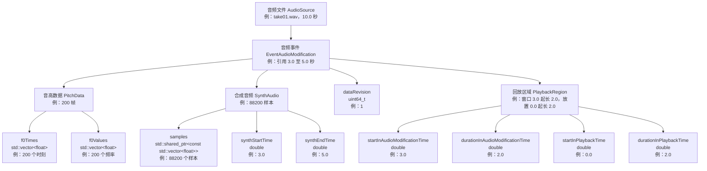

# 目标数据结构

本文描述插件的目标数据结构。

## 1. 中心

以走带上的一个音频事件为中心。音频事件是用户在时间线上拖动、切分、修剪的对象，
用户的每一个操作都作用在它身上。音频事件对应宿主 ARA 对象图中的 AudioModification，
插件以子类 EventAudioModification 承载它，音高数据与合成音频全部作为该子类的成员存在。
窗口与放置属于宿主的 PlaybackRegion，插件在需要时实时读取，不保存任何副本。

## 2. 术语表

- 音频事件（EventAudioModification）：走带上一段参与分析与合成的音频内容，宿主 AudioModification 的插件子类实例，持有音高数据与合成音频。
- 音频文件（AudioSource）：宿主持有的音频文件对象，音频事件的归属者，一个音频文件下面可以有任意多个音频事件。
- 回放区域（PlaybackRegion）：宿主对象，描述音频事件的一个窗口与一次放置，一个音频事件下面可以有任意多个回放区域。
- 窗口：回放区域引用的音频文件内区段，由 startInAudioModificationTime 与 durationInAudioModificationTime 给出，文件坐标，宿主实时给出。
- 放置：回放区域在走带上的位置与时长，由 startInPlaybackTime 与 durationInPlaybackTime 给出，走带坐标，宿主实时给出。
- 文件坐标：以音频文件起点为原点的时间坐标，单位秒，音高数据与合成音频的全部时间字段使用文件坐标。
- 走带坐标：以走带零点为原点的时间坐标，单位秒，放置字段使用走带坐标。
- 音高数据（PitchData）：一次分析得到的音高序列，空 optional 表示未分析。
- 合成音频（SynthAudio）：一次合成得到的样本序列及其覆盖区间，空 optional 表示未合成。
- 覆盖区间：合成音频在文件坐标里有效的范围，左闭右开，由 synthStartTime 与 synthEndTime 给出。
- 任务（taskId）：JobManager 中一次分析或合成请求的编号，类型 uint64_t，结果写回发起请求的音频事件。
- dataRevision：音频事件的音高数据或合成音频被整体替换的次数，初始为 0，每替换一次加一。

## 3. 对象树

归属方向自上而下：音频文件持有音频事件，音频事件持有音高数据、合成音频与回放区域。
以音频事件为叙述根。

取值的特殊含义：pitchData 为空表示未分析；synthAudio 为空表示未合成；
dataRevision 为 0 表示自创建以来没有任何数据写入。

## 4. 字段说明

顺序与对象树一致。

音频文件 AudioSource：

- persistentID：宿主分配的稳定标识，归档按它记录音频文件来源。

音频事件 EventAudioModification：

- 归属：构造时由宿主经 doCreateAudioModification（ARAPlug.h:948）传入所属 AudioSource。
同一音频文件下的多个音频事件彼此独立，各自持有一份音高数据与合成音频，
支持各自使用不同的音色与参数合成。
- pitchData：std::optional&lt;PitchData&gt;。空表示未分析。
- synthAudio：std::optional&lt;SynthAudio&gt;。空表示未合成。
- dataRevision：uint64_t，初始 0。音高数据或合成音频被整体替换时加一。

PitchData：

- f0Times：std::vector&lt;float&gt;，单位秒，文件坐标。第 i 个时刻等于发起分析时读取到的
窗口起点加 i 乘 0.01，0.01 秒为分析帧间隔。
- f0Values：std::vector&lt;float&gt;，单位 Hz，与 f0Times 一一对应。

SynthAudio：

- samples：std::shared_ptr&lt;const std::vector&lt;float&gt;&gt;，采样率 44100，单声道。
下标 0 对应文件坐标 synthStartTime，第 i 个样本对应文件坐标 synthStartTime 加 i 除 44100。
- synthStartTime：double，单位秒，文件坐标，覆盖区间起点，含。
- synthEndTime：double，单位秒，文件坐标，覆盖区间终点，不含。

PlaybackRegion（四个字段全部属于宿主，插件实时读取，不保存副本）：

- startInAudioModificationTime：double，单位秒，文件坐标，窗口起点。
- durationInAudioModificationTime：double，单位秒，窗口长度。
- startInPlaybackTime：double，单位秒，走带坐标，放置起点。
- durationInPlaybackTime：double，单位秒，放置时长。
- 读取接口：getStartInAudioModificationTime() 与 getDurationInAudioModificationTime()
（ARAPlug.h:606-607），getStartInPlaybackTime() 与 getDurationInPlaybackTime()（ARAPlug.h:616-617）。
- 分析与合成的范围取该事件全部回放区域窗口的并集，发起请求时实时读取。

任务：

- taskId：uint64_t，JobManager 内全局递增，完成回调按它找到发起请求的音频事件并写回结果。

持久化：

- 归档时音高数据与合成音频随宿主文档写出，键为 AudioModification::getPersistentID()
（ARAPlug.h:536），内容为 JSON，含 pitchData 与 synthAudio 两部分；音频文件来源按
AudioSource 的 persistentID 记录。读回时按同样的键从宿主对象图查找事件并恢复。

## 5. 取值走查

场景：音频文件 10 秒，一段事件经历合成、缩短、拉长、切分、挪动音轨。

| 步骤 | 操作 | 关键字段变化 |
| --- | --- | --- |
| 1 | 宿主载入 take01.wav | AudioSource 建立，时长 10.0 秒，persistentID 记入归档 |
| 2 | 用户在走带上选中 3.0 至 5.0 秒生成事件 | 宿主调用 doCreateAudioModification，optionalModificationToClone 为空；pitchData 无，synthAudio 无，dataRevision 0；回放区域窗口 3.0 起长 2.0，放置 0.0 起长 2.0 |
| 3 | 用户点击合成 | 插件读取全部回放区域窗口并集 3.0 至 5.0，提交 taskId 1；完成后写回 synthAudio：samples 88200 个样本（2.0 乘 44100），synthStartTime 3.0，synthEndTime 5.0；dataRevision 1 |
| 4 | 用户把事件缩短到 3.0 至 4.0 秒 | 宿主把窗口改为起点 3.0 长 1.0；synthAudio 与 pitchData 原样，覆盖区间仍为 3.0 至 5.0 |
| 5 | 用户把事件拉长到 3.0 至 6.0 秒 | 窗口改为起点 3.0 长 3.0；回放把走带位置映射回文件坐标，3.0 至 5.0 落在覆盖区间内播合成音频，5.0 至 6.0 落在覆盖区间外播宿主原声；第 4 至 5 秒的合成音频在步骤 4 中没有任何数据被删除，拉长后原样播出 |
| 6 | 用户把事件切分为 A1（3.0 至 4.0）与 A2（4.0 至 5.0） | 宿主销毁旧回放区域，新建两个。宿主保留同一个 AudioModification 时，两个区域共享同一份 pitchData 与 synthAudio；宿主调用 cloneAudioModification 时，新事件构造函数从 optionalModificationToClone 复制 pitchData、synthAudio、dataRevision，两份独立，此后 A1 重新合成，A2 不受影响 |
| 7 | 用户把 A1 挪动到另一条音轨 | 宿主更新 startInPlaybackTime；窗口、pitchData、synthAudio 全部不变，回放按新的放置换算文件坐标 |

## 6. 禁止事项

不使用 ASCII 画图。
