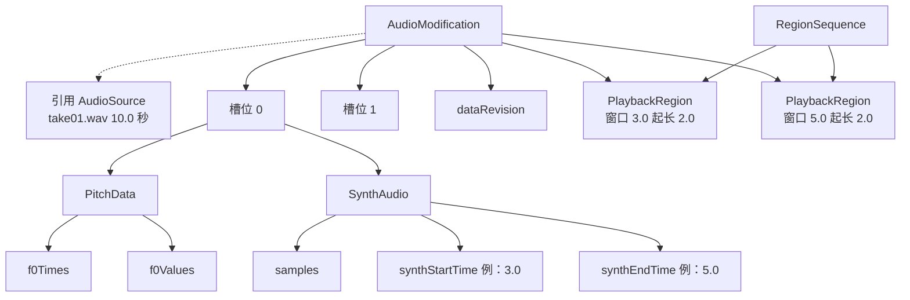

# 目标数据结构

插件状态挂在 AudioModification 上。时间线上的一块是 PlaybackRegion，只描述窗口与放置。

## 1. 中心

数据树的根是 AudioModification。一份可编辑内容对应一份 AudioModification。

音高数据、合成音频、dataRevision、两个槽位里的音色与参数，全部是该 AudioModification 的成员。

同一份 AudioModification 拥有任意数量的 PlaybackRegion。这些区域读写同一份成员。改其中一块，其余块一起变。

PlaybackRegion 的窗口、放置、RegionSequence 由宿主持有，插件实时读取，不保存副本。

AudioSource 是样本来源。AudioModification 通过 getAudioSource() 引用它以读取样本。AudioSource 不出现在数据树的根上，也不持有音高或合成结果。

音高分析与合成的范围相同：发起请求时，取该 AudioModification 上全部 PlaybackRegion 窗口的工作区间，即各窗口起点的最小值到各窗口终点的最大值，一段连续的文件坐标。两块之间的空隙包含在这一段里，一次请求读取这一段连续样本。

音高分析完成后，把得到的音高序列存进该槽位的 pitchData。f0Times 使用文件坐标，第 i 个时刻等于这次工作区间的起点加 i 乘 0.01。缩短窗口不裁剪已存进 pitchData 的数据。

合成完成后，引擎得到一段连续 PCM 样本，插件把这段样本存进该槽位的 synthAudio 成员。synthStartTime 与 synthEndTime 记下这段样本对应文件里的哪一段，等于这次工作区间。存进 synthAudio 之后，覆盖区间就是这一段，直到下一次合成把 synthAudio 整段换成新的。缩短窗口不裁剪已存进 synthAudio 的样本。某个 PlaybackRegion 窗口里位于覆盖区间之外的部分，回放无声，界面标为尚未合成。

独立的第二份成员只在宿主调用 cloneAudioModification 时出现。插件在 doCreateAudioModification 收到非空 optionalModificationToClone，把成员复制进新的 AudioModification。Studio One 对应命令：分离共享副本（Option+C）、新建剪辑版本。切分、复制、Duplicate、Option 拖动、挪动音轨不会调用 cloneAudioModification。

构造只发生在宿主调用的 doCreateAudioModification 里。没有宿主 hostRef 与 persistentID 的对象，宿主不会往上挂 PlaybackRegion，也不会按它归档。

## 2. 术语表

- AudioModification：数据树的根。一份可编辑内容。持有音高、合成、槽位、dataRevision。宿主创建与克隆，插件实现 doCreateAudioModification。
- AudioSource：宿主音频文件。AudioModification 用 getAudioSource() 引用它读样本。一份文件下可以有多份 AudioModification。
- PlaybackRegion：时间线上的一块。给出窗口、放置、所属 RegionSequence。一份 AudioModification 下可以有多个 PlaybackRegion。
- RegionSequence：时间线上的一条音轨。PlaybackRegion 通过 getRegionSequence() 给出，插件不保存副本。
- 共享副本：多个 PlaybackRegion 属于同一 AudioModification。
- 克隆：宿主 cloneAudioModification，成员复制到新的 AudioModification，两份此后独立。
- 窗口：startInAudioModificationTime 与 durationInAudioModificationTime，文件坐标。窗口终点为起点加时长。
- 工作区间：该 AudioModification 上全部 PlaybackRegion，起点为各窗口起点的最小值，终点为各窗口终点的最大值，一段连续文件坐标。两块之间的空隙包含在内。音高分析与合成每次读取这一段连续样本。
- 放置：startInPlaybackTime 与 durationInPlaybackTime，时间线坐标。
- 文件坐标：以被引用 AudioSource 起点为原点，单位秒。音高与合成的时间字段用文件坐标。
- 时间线坐标：以时间线零点为原点，单位秒。放置用时间线坐标。
- PitchData：一次分析得到的音高序列，空 optional 表示未分析。时间字段对应发起分析时的工作区间。
- SynthAudio：一次合成得到的样本与覆盖区间，空 optional 表示未合成。
- 覆盖区间：synthStartTime 含，synthEndTime 不含，文件坐标。标出这段 PCM 在文件里对应哪一段。
- 尚未合成区间：某个 PlaybackRegion 窗口里、位于覆盖区间之外的文件坐标。回放输出无声，界面标为尚未合成。
- 槽位：一份 AudioModification 上两个槽位，activeSlot 为 0 或 1。每个槽位各自持有 params、timbreFile、pitchData、synthAudio、bypass。
- dataRevision：该 AudioModification 上音高或合成被整体替换的次数，初始 0。
- taskId：JobManager 一次分析或合成的编号，结果写回发起请求的那份 AudioModification。

## 3. 对象树

pitchData 为空：未分析。synthAudio 为空：未合成。dataRevision 为 0：从未写入。

## 4. 字段

AudioModification：

- persistentID：宿主分配。归档键。同一会话内与指针一同标识这一份内容；重新打开工程后指针更新，persistentID 不变。
- 引用的 AudioSource：getAudioSource()。构造时由宿主传入。
- slots：长度 2。下标 0 与 1。
- activeSlot：int，0 或 1。
- dataRevision：uint64_t。
- sourceAudio：从被引用 AudioSource 读出、重采样到 44100 的单声道缓存。

被引用的 AudioSource：

- persistentID：宿主分配。
- 时长：sampleCount / sampleRate。

槽位：

- params：当前编辑中的合成参数。
- timbreFile：当前选中的音色文件名。
- pitchData：optional PitchData。
- synthAudio：optional SynthAudio。
- synthParams / synthTimbreFile：把合成结果存进 synthAudio 时所用的参数与音色。
- lastSynthElapsedSeconds：optional，最近一次合成耗时。
- bypass：bool。为真时该槽位回放宿主原声。

PitchData：

- f0Times：vector of float，秒，文件坐标。第 i 个时刻等于发起分析时工作区间的起点加 i 乘 0.01。0.01 秒为分析帧间隔。
- f0Values：vector of float，Hz，与 f0Times 等长。
- 发起分析时：取该 AudioModification 的工作区间，读这一段连续样本送去分析。

SynthAudio：

- samples：shared_ptr of const vector of float，44100，单声道。下标 0 对应文件坐标 synthStartTime，第 i 个样本对应 synthStartTime 加 i 除 44100。
- synthStartTime：double，秒，文件坐标，覆盖区间起点，含。
- synthEndTime：double，秒，文件坐标，覆盖区间终点，不含。
- 发起合成时：取该 AudioModification 的工作区间，读这一段连续样本送去合成；完成后把样本存进 synthAudio，synthStartTime / synthEndTime 等于这一段。
- 回放：时间线时刻映射到文件坐标，位于覆盖区间内读 samples，之外输出无声。

PlaybackRegion：

- startInAudioModificationTime、durationInAudioModificationTime。
- startInPlaybackTime、durationInPlaybackTime。
- RegionSequence：getRegionSequence()。
- getAudioModification()：所属 AudioModification。指针为 const，插件不能改挂。
- 不以 PlaybackRegion 指针或 getPersistentID() 作为数据键。
- 界面：窗口与覆盖区间求交的部分按已合成绘制；窗口内位于覆盖区间外的部分标为尚未合成。

任务：

- taskId：uint64_t，进程内递增。完成回调按 AudioModification::getPersistentID() 与槽位写回。

持久化：

- 一条归档记录对应一份 AudioModification。键为 getPersistentID()。JSON 含 slots、activeSlot、dataRevision。
- 读回时按该键从宿主对象图取 AudioModification 并恢复成员。

## 5. 宿主操作

平移：同一 PlaybackRegion，只改 startInPlaybackTime。AudioModification 不变。覆盖区间不变。

切分：doCreatePlaybackRegion 挂在原 AudioModification 上，再缩短原窗口。两块共享成员。clone 为空。覆盖区间不变。

复制、Duplicate、Option 拖动：新 PlaybackRegion 挂在同一 AudioModification。共享副本。

分离共享副本、新建剪辑版本：cloneAudioModification。单选：该块挂到新的 AudioModification，成员从原份复制。多选：新建剪辑版本给选中块同一份新 AudioModification；分离共享副本给每一块各一份。

挪动音轨：第一次编辑事务销毁 PlaybackRegion。第二次编辑事务在同一 AudioModification 上 doCreatePlaybackRegion，换 RegionSequence。成员仍在原 AudioModification 上。

打开工程：按归档 persistentID 重建 AudioModification，再为每个窗口创建 PlaybackRegion。

删除 PlaybackRegion：该区域消失。同一 AudioModification 上还有其它 PlaybackRegion 时，成员仍在。全部区域删除后宿主 deactivate 或 destroy 该 AudioModification。

并轨所选：新的 AudioSource，因而新的 AudioModification。

## 6. 场景核对

被引用文件时长 10.0 秒。

| 步骤 | 操作 | 结果 |
| --- | --- | --- |
| 1 | 载入 take01.wav | AudioSource 时长 10.0 |
| 2 | 时间线上放出窗口 3.0 至 5.0 | 一份 AudioModification，成员空，dataRevision 0；一个 PlaybackRegion，窗口 3.0 起长 2.0，放置 0.0 起长 2.0 |
| 3 | 音高检测与合成 | 工作区间 3.0 至 5.0；pitchData 的 f0Times 从 3.0 起；synthAudio 88200 样本，synthStartTime 3.0，synthEndTime 5.0；dataRevision 递增 |
| 4 | 窗口缩短到 3.0 至 4.0 | 只改 PlaybackRegion 窗口；覆盖区间仍为 3.0 至 5.0 |
| 5 | 窗口拉长到 3.0 至 6.0 | 窗口 3.0 起长 3.0；覆盖区间仍为 3.0 至 5.0。回放 3.0 至 5.0 播出合成音频，5.0 至 6.0 无声，界面标尚未合成 |
| 6 | 切成 3.0–4.0 与 4.0–5.0 | 同一 AudioModification 上两个 PlaybackRegion；共享覆盖区间 3.0 至 5.0。改音高两块一起变 |
| 7 | 平移其中一块 | 该 PlaybackRegion 的 startInPlaybackTime 改变；成员与覆盖区间不变 |
| 8 | 把其中一块挪到另一条音轨 | 销毁再创建 PlaybackRegion，仍 getAudioModification() 到原份；成员仍在 |
| 9 | 对其中一块做分离共享副本 | 新的 AudioModification，成员与覆盖区间复制；此后两份独立 |

## 7. 禁止

插件状态只写在 AudioModification 上。
AudioSource 不得作为数据树的根。
不按 PlaybackRegion 建第二份成员，不用 PlaybackRegion::getPersistentID() 归档。
不保存窗口、放置、RegionSequence 的副本。
切分、缩短、平移、挪动音轨不裁剪 pitchData 与 synthAudio。
插件不得把 PlaybackRegion 改挂到自己 new 的 AudioModification 上。
窗口超出覆盖区间的部分输出无声，界面标为尚未合成。
